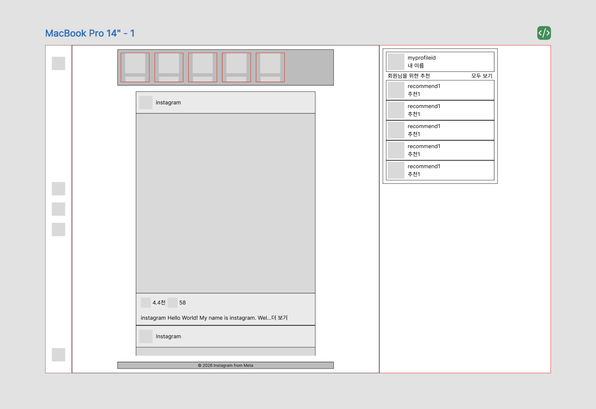

# instagram-mockup

# 📱 인스타그램 목업 만들기 미션

구름 풀스택 20기 4팀 미니 프로젝트: 인스타그램 목업 페이지 레이아웃 구현 과제입니다.

## 1. 프로젝트 개요

- 목표: 인스타그램의 핵심 UI를 HTML/CSS만으로 구현하여 웹 퍼블리싱 기초 역량 습득
- 중점 사항: HTML 시맨틱 태그 사용, CSS 레이아웃 설계, 반응형 UI 구현

## 2. 웹 서비스 목업 기획 및 설계

### 와이어프레임

- 인스타그램 레이아웃을 분석하고 figma를 이용해 와이어프레임 생성

### 개발 문서 (Technical Specs)

- HTML5: 웹 접근성과 SEO를 고려하여 header, nav, main, section 등 시멘틱 태그 사용
- CSS3:
  - Flexbox를 활용한 정렬된 레이아웃 구현
  - CSS Grid를 활용한 Search 페이지의 추천탭 카드 리스트 구현
  - Media 쿼리를 활용한 모바일/웹 대응 레이아웃 구현

## 3. 습득 역량 및 결과

- HTML 마크업 기술
- CSS 스타일링 기술
- 와이어프레임 기반 디자인
- 미디어쿼리를 이용한 반응형 UI 구현

---

작성자: 구름 풀스택 20기 김민경 제출일: 2026-02-06
